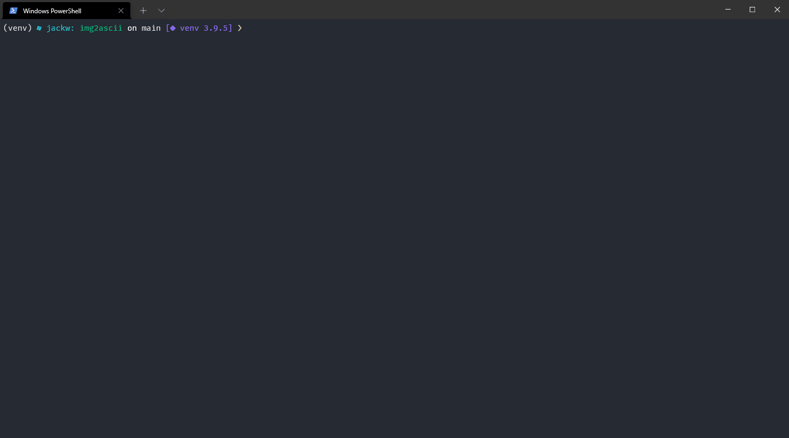

# img2ascii
Transform an image into an ascii representation. Supports colours also.



## Installation

Clone the github repository and then run the following command in the root directory to install the python dependencies.

```
pip install -r requirements.txt
```

## Usage

```
usage: main.py [-h] [--ascii-start ASCII_START] [--ascii-stop ASCII_STOP] [--output OUTPUT] [--coloured-foreground] [--colour-background | --light-background | --dark-background] source

Convert an image into ascii art.

positional arguments:
  source                the filename of the image to convert to ascii

optional arguments:
  -h, --help            show this help message and exit
  --ascii-start ASCII_START, --start ASCII_START
                        The starting value of the ascii characters
  --ascii-stop ASCII_STOP, --stop ASCII_STOP
                        The end value of the ascii characters
  --output OUTPUT, -o OUTPUT
                        Optional output file to save as image
  --coloured-foreground, -cf
                        Use coloured printing to the terminal
  --colour-background, -cb
                        Use coloured background when printing
  --light-background, -lb
                        Use a light background when printing
  --dark-background, -db
                        Use a dark background when printing
```

## Libraries used

 - [NumPy](https://numpy.org/) - For the number crunching
 - [PIL](https://pillow.readthedocs.io/en/stable/) - For image processing
 - [Colorama](https://pypi.org/project/colorama/) - For using colours when printing to the terminal
 - [Numba](https://numba.pydata.org/) - To compile the number crunching functions into more performant code

## Contributing
Pull requests are welcome. For major changes, please open an issue first to discuss what you would like to change.

## Author
Jack Whelan

You can find me on [LinkedIn](https://www.linkedin.com/in/jack-whelan-1707491aa) 

## License
This project is licensed under the [MIT](LICENSE) License.
